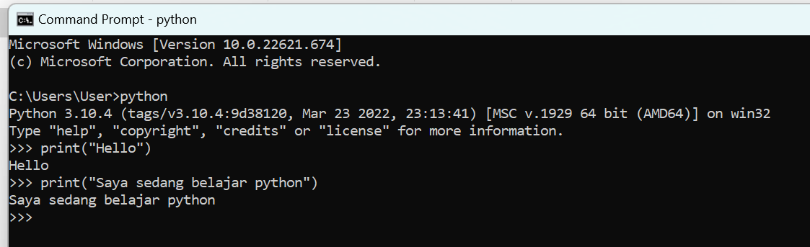
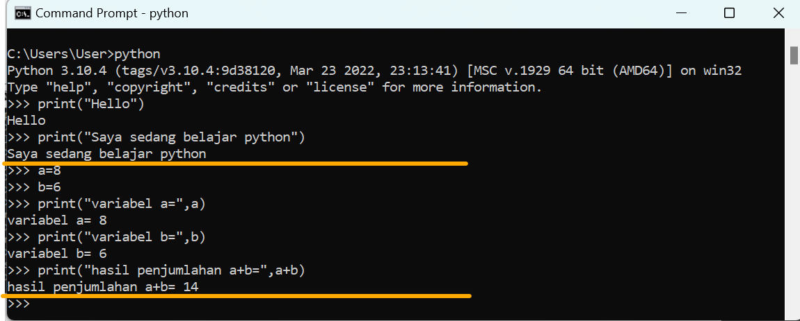

# lab2py

<strong>Repository ini dibuat untuk memenuhi tugas Bahasa Pemrograman</strong>
| <strong>Nama</strong> | <strong>Riris Naomi Gurning</strong> |
| ----------- | ----------- |
| <strong>NIM</strong> | <strong>312010190</strong> |
| <strong>Kelas</strong> | <strong>TI.22.A.1</strong> |

# <strong>Latihan 1 " Menjalankan Python Console menggunakan CMD" </strong>

## • Menampilkan tulisan “Hello” dilayar.  • Menampilkan tulisan “Saya sedang belajar python” dilayar. 

# <strong>Latihan 2 " Menjumlahkan dua buah bilangan menggunakan variabel a dan b." </strong>

## • Mendefinisikan variable a dengan nilai 8 • Mendefinisikan variable b dengan nilai 6 • Mencetak nilai variable a dan b • Mencetak hasil penjumlahan a+b. 

# <strong>Latihan 3 " Menjalankan IDLE" </strong>
